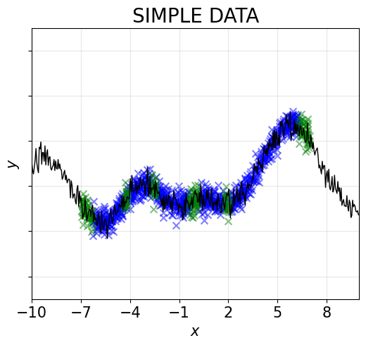
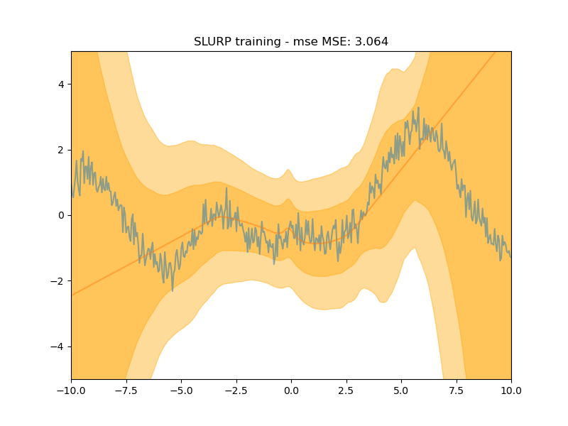
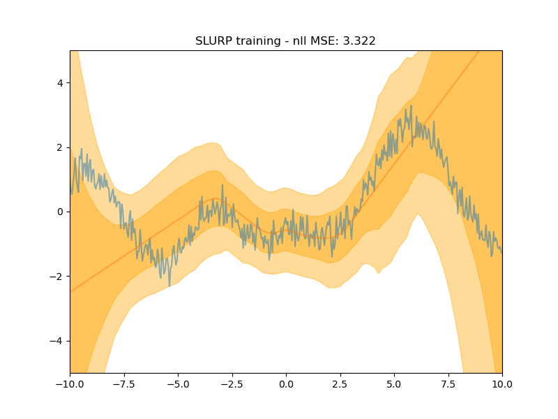

## 1D Regression Toy Example
Our goal is to jointly train a main task estimator and an uncertainty estimator which can provide an uncertainty interval for each data point to correctly cover the potential ground truth. It is just a toy example to show the potential of SLURP on 1D dataset and the performance of jointly training. In `train_slurp.py`, the two tasks are jointly trained but seperatly back-propagated, which means that they won't affect each other. It is easy to realise it on toy example. 

However, for 2D regression tasks, if one has difficulties training the main task model or only checkpoint is provided without training codes, it then has to use sequential training, which means we train SLURP after we get the main task checkpoint. 

## Requirements:
This example is correctly run with python 3.8, but it is possible to use other python 3.x versions. Moreover, you can creat a new conda environment then install the required packages with following lines.

    conda create -n yourenv python=3.8
    conda activate yourenv
    pip install -r requirements.txt

## Steps:
You can use the default settings as follows:

1/ Generating data by using Gaussian process:
    
    python save_data.py

2/ Training main task estimator and its uncertainty estimator together:

    python train_slurp.py

## Results:
We provide a quick result as an illustration for joint training for main task model and uncertainty model. 
First we genereate a simple dataset with training data (blue) and validation data (green). 

Then we train our models and we can get the following results. The results are picked according to the best MSE and the best NLL:

 
 
 

After generating a toy dataset dataGP.hdf5, we can achieve an example of trained models and refinement results, we saved the results in [./toy_slurp_models/](./toy_slurp_models/).

We are doing some interesting experiments to broaden the possibilities of SLURP. It seems to be about to succeed, and it may be uploaded in the near future.
